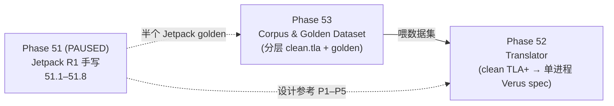

# Clean-Subset TLA+ → Verus (tla-rs) Translator — 项目计划

## 0. 愿景与范围

**愿景**:一个 **AST 级别的确定性 translator**,把"干净子集(clean subset)"的 TLA+ 全局多-server spec 自动翻译成 tla-rs 的**单进程 Verus spec**(`LInit`/`LNext`/动作谓词)。

**为什么可行**(前期结论):全局→单进程一般**不可**自动化——因为"消息化决策"是人的设计,信息论上原 spec 里根本缺这个信息。但**若把输入限制成"已经消息化好的干净子集"**(无瞬时跨节点读、无 history vars、messages 约定为网络),剩下的转换(去 `[i]` 投影、messages→框架收发、quorum→计数、frame 生成)**大体是机械可自动的**。本项目就是把"可自动的那一半"做成工具。

**范围边界**:
- ✅ 覆盖:clean TLA+ → 单进程 Verus **spec**(protocol 层)。
- ❌ 不覆盖:refinement / safety **证明**生成(仍是人工,RSL 级);也不覆盖"把脏 spec 自动改写成 clean"(改写是人工,见 §3)。
- 🔶 待定:rule-based(默认)vs learning-based(见 Q1)。

## Phase 结构:53(数据集)→ 52(translator)→ 51(参考)

**咬合**(数据集的 tier 必须先于对应的 translator 里程碑):

| Phase 53(数据集) | 先于 | Phase 52(里程碑) |
|---|:---:|---|
| 53.2 Tier-0 简单 | → | 52.M1 投影 |
| 53.3 Tier-1 Paxos/2PC | → | 52.M2 messages/quorum |
| 53.4 Tier-2 Raft/EPaxos | → | 52.M4 |
| 53.5 Tier-3 Jetpack | → | 52.M4b |

- **Phase 53 是地基**:没有数据集,translator 无从 TDD / 回归 / 验证。
- **Phase 52 是主项目**:消费数据集,产出 translator(**只生成 spec,不含证明**)。
- **Phase 51 PAUSED**:不再手写补完,但 51.1–51.8 保留为 (a) 设计投影 pass(P1–P5)的**参考**,(b) Jetpack 的**半个 golden**(喂 53.5)。

---

## 1. Clean TLA+ Subset(输入契约)+ Linter

整个项目的地基:精确定义什么样的 TLA+ 是"可投影的",并做 linter 在入口 gate。

**契约(初版)**:
- **C1 per-node 状态**:每个 `VARIABLE` 是 `[Node -> T]`(每节点一份),或全局常量。
- **C2 无瞬时跨节点读**:动作 `Action(self, ...)` 只能读 `x[self]`(本节点)、动作参数、收到的消息 `m`;禁止 `x[other]`(other ≠ self)。
- **C3 无 history variables**:禁止聚合多节点的 ghost 变量(如 `allLogs == UNION {log[i] : i \in Server}`)。
- **C4 messages 约定为网络**:恰有一个指定变量(`messages`/`sentMsg`/…)是全局消息集合,只通过白名单算子(Send/Reply/Discard/Receive)操作,消息带 `src`/`dst`。
- **C5 动作以 node 为参数**:`Next == \E self \in Node : Action(self)`(+ 消息投递等环境动作)。

**Linter**:静态检查 C1–C5,违反给**精确报错**(如 `line X: action reads state[j] where j != self — not projectable; message-ify it first`)。这把"人工改写"与"自动翻译"之间的边界**可执行地**画出来。

**产出**:subset 规范文档 + linter(复用 tla-rs 的 tla parser + 一个 AST walker)。

---

## 2. Translator 架构

**复用**:tla-rs 已有 `transpiler/src/tla/`(tokenizer/parser/ast/translator,AST-based,已能翻译单进程 `s/s_`)。**不新建,扩展它。**

**核心新增 pass — Projection(投影)**(项目的技术核心):
- **P1 状态投影**:`[Node -> T]` 数组 → 单节点 `s.field`,丢掉 Node 维度。
- **P2 动作去索引**:body 里 `x[self]` → `s.x`,`x'[self]` → `s_.x`;`\E self : Action(self)` → 单节点 `Next(s, s_)`。
- **P3 messages → 框架收发**:`Send(m)` → 动作输出一条 out-message(框架发);`Receive(m)`/`\E m \in messages` → 动作把 `m` 作为**参数**(框架收)。消息不再是被验证状态的一部分。
- **P4 quorum → 计数**:`S \in Quorum` / `Cardinality(S)*2 > N`(S 是本节点累积的响应集)→ `s.responses.len()*2 > N`(本地计数)。
- **P5 frame condition 自动生成**:一步只改本节点少数字段,其余自动补 `s_.x == s.x`(这正是手写 spec 最易漏的,自动化收益最大)。

**小扩展的 pass**:type inference(clean subset 辅助推断)、既有 TLA+→Verus 表达式映射(`/\`→`&&&` 等)、补 messages bag 需要的 `@@`/`:>` token。

**产出**:`clean-tla` 子命令,输出单进程 Verus spec。

---

## 3. Corpus(数据集)

**定位**(见 Q1):默认是 rule-based translator 的 **dev/test/eval 语料库**(TDD + 回归 + 覆盖),不是训练集。

**每个 entry 四件套**:
1. `original.tla` — 网上找到的原始 spec。
2. `clean.tla` — 人工改写成 clean subset 的版本。
3. `rewrite.md` — 改写说明(删了哪些 history vars、哪些瞬时读被消息化成什么消息、messages 变量是哪个)。
4. `expected.rs`(golden) — 期望的单进程 Verus spec 输出。

**分层 corpus**(来自 corpus 调研 2026-08;主入口 = `tlaplus/Examples` 1550★,约 100+ specs,README 有作者/是否含 TLC/TLAPS 标注):

- **Tier 0 — simple/micro**(clean-distance **低**,先跑通 translator + 回归冒烟):
  互斥类 **Bakery / Peterson / Dijkstra**、**DiningPhilosophers**、**BlockingQueue**(生产者-消费者)、**Readers-Writers**;**TeachingConcurrency**(自带 TLAPS 证明,可顺带验证"spec→Verus 证明"链路)。有限状态、语言子集干净。
- **Tier 1 — 中等 consensus**(clean-distance **中**,有 tla-rs 手写 spec 可对照):
  **Paxos**(single-decree,tlaplus/Examples)、**TwoPhase / transaction_commit**(2PC)、**MultiPaxos-SMR**(RSM 主题 + TLAPS 证明)。
- **Tier 2 — 复杂,已消息化**(clean-distance **中**,改写≈删 history vars + 标 messages):
  **Raft**(ongardie 517★ / Vanlightly 变体含 KRaft)、**EPaxos**(egalitarian-paxos,Moraru)、**CCF ccfraft**(工程化,870★,可选)。前期范式调研已确认**这些无瞬时跨节点读**,改写量主要在删 history vars(allLogs/elections/voterLog)。
- **Tier 3 — 硬**(clean-distance **高**,最后):
  **Jetpack**(瞬时全局读 + 3-D log + INSTANCE 组合;**Phase 51 手写的 R1 spec 即其 golden**)、BFT 系(byzpaxos/BPCon、PBFT 教程,可选扩展)。

> 完整清单(7 家族)见 corpus 调研结果;`gh api repos/tlaplus/Examples/contents/specifications --jq '.[].name'` 可列全部。⚠️ 排除只有 PDF、无机读 `.tla` 的目录(**fastpaxos / naiad / losa_rda**)。

**获取流程**:
1. **主入口** `tlaplus/Examples`(最系统);补充来源:`ongardie/raft.tla`、`fpaxos/*`、`Vanlightly/{raft,vsr}-tlaplus`、`microsoft/CCF`、`ailidani/paxi`、`tlaplus/awesome-tlaplus`、`tlaplus/DrTLAPlus`。
2. **每个候选**:下载 `.tla` → **linter 预检 clean 距离** → 人工改写成 clean(按 playbook)→ **TLC 强档保真(vs original,见 §4 V2)** → `golden.rs`。
3. **优先级**:Tier 0(冒烟/回归)→ Tier 1(有对照,含 MVP 的 Paxos)→ Tier 2(Raft→EPaxos)→ Tier 3(Jetpack)。

**改写 Playbook**:一份"如何把任意 TLA+ 改写成 clean subset"的规范。这是**人工步骤**(前期论证过不可自动),但要可重复、可 review。

---

## 4. 评估与正确性

- **V1 翻译正确性**:translator 输出的 Verus spec 能 `verus` 通过(至少 type-check + LInit/LNext 良构)。
- **V2 语义保真(最关键)**:`clean.tla` 与 `original.tla` 的 **TLC model-checking 结果一致**(可达状态数/不变式),确保**人工改写没改变语义**。改写是人做的、易错,这层是 QA 命脉。
- **V3 golden 回归**:translator 输出对照 `expected.rs`,防回归。
- **V4 端到端抽查**:clean.tla → translator → Verus spec →(人工)加 impl+refinement → 验证(至少 Tier 1 一两个)。

---

## 5. 里程碑

| M | 内容 | 验收 |
|---|---|---|
| **M0** | Clean subset 规范 + Linter | linter 正确接受/拒绝 corpus 的 clean/dirty 样本 |
| **M1** | Projection pass(P1/P2/P5) | Tier 0 micro 端到端翻译,输出 verus 通过 |
| **M2** | messages→框架(P3)+ quorum→计数(P4) | Tier 1(Paxos/TwoPhase)翻译,对照 tla-rs 手写 spec |
| **M3** | 语义保真(V2 TLC 对照)+ golden 回归(V3) | Tier 0/1 全绿 |
| **M4** | Tier 2:Raft → EPaxos → Jetpack | 三个复杂例子翻译 + verus 通过 + TLC 保真 |
| **M5** | 文档(subset 规范、改写 playbook、evidence)+ 集成进 tla-rs pipeline | — |

---

## 6. 风险与开放问题

- **R1 改写是人工瓶颈**:clean 化质量取决于人;靠 playbook + V2 TLC 保真做 QA。
- **R2 subset 边界迭代**:太严→很多 spec 不满足;太松→投影不了。M0–M2 会暴露边界。
- **R3 scope 蔓延**:坚持"只生成 spec,不生成证明"。
- **Q1 → 已定:rule-based**(确定性 AST translator;corpus 是 dev/test/eval,非训练集)。
- **Q2 → 已定:先禁掉 reconfig**(clean subset 不涵盖 membership 变化;Raft/Jetpack 的 view/epoch 部分在改写时剥离)。
- **Q3 → 已定:强档**(V2 用 exact-state/行为对照,复用 Phase 36 的 exact-state parity 基础设施做 clean.tla vs original.tla 的可观测量对照)。

---

## 7. 相关工作定位

- **PGo / MPCal**(最相近):MPCal 是 PlusCal→Go,靠 archetype(局部化)+ mapping macro(人工标网络)。我们是 **TLA+→Verus spec**,且把 clean subset 显式化 + 自动投影。可借鉴其约束思想。
- **IronFleet / tla-rs**:我们**自动化了 IronFleet 手写 protocol 层的一部分**(当输入已 clean)。
- **Choreography / endpoint projection**:唯一可证明自动的全局→局部,但只管控制流;我们处理数据/quorum。

---

## 8. MVP 建议

先做 **M0–M2**(subset + linter + 投影 + messages/quorum),跑通 Tier 0 + **Paxos** 作为 killer demo(有 tla-rs 手写 spec 对照)。这就证明了核心命题——"clean 全局 TLA+ 可自动投影成单进程 Verus spec"。然后 Raft(改写量小),Jetpack 放最后(改写最重,R1 已有 golden)。
