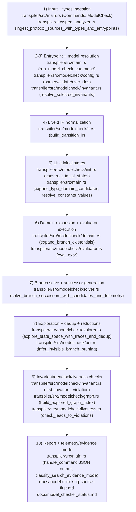

# tla-rs Source-First Model Checking

## Beginner Context
This chapter explains the model checker that is currently implemented in this repository. The key idea is "source-first": the engine evaluates the Rust/Verus spec sources (`LInit`, `LNext`, invariants, helpers) directly, instead of translating to a TLC wrapper as an intermediate execution path.

## End-to-End Source-First Path (Ordered)
1. **Rust/Verus input sources and type sources**: `verus-transpile model-check` ingests the protocol spec (`--input`) and type source (`--types`, defaulting to sibling `types.rs`) with `ingest_protocol_sources_with_types_and_entrypoints`.
   - Anchor: `transpiler/src/main.rs` (`Commands::ModelCheck`, `run_model_check_command`)
   - Anchor: `transpiler/src/spec_analyzer.rs` (`ingest_protocol_sources_with_types_and_entrypoints`)

2. **Entrypoint resolution (`LInit`, `LNext`, invariants, fairness)**: init/next names are resolved from parsed spec functions, invariant names are resolved to concrete functions, and fairness labels are validated against normalized branch labels.
   - Anchor: `transpiler/src/main.rs` (`run_model_check_command`, `validate_fairness_labels_against_lnext_branches`)
   - Anchor: `transpiler/src/modelcheck/invariant.rs` (`resolve_selected_invariants`)

3. **`model.toml` parsing/override resolution**: `model.toml` is parsed, validated, and then updated with CLI overrides (`--max-depth`, `--max-states`, `--timeout`, etc.). `--invariant` overrides replace `properties.invariants` after duplicate/empty checks.
   - Anchor: `transpiler/src/modelcheck/config.rs` (`parse_model_config_file`, `apply_model_config_overrides`, `validate_model_config`)
   - Anchor: `transpiler/src/main.rs` (`run_model_check_command`)

4. **Branch IR normalization from `LNext`**: the tool normalizes `LNext` into disjunctive branch IR (`branch_0`, `branch_1`, ...), collects branch-scoped existentials, and classifies each branch constraint as assignment-style equality or general predicate.
   - Anchor: `transpiler/src/modelcheck/ir.rs` (`build_transition_ir`, `discover_lnext_branches`)
   - Anchor: `transpiler/src/main.rs` (`execute_model_check`)

5. **Initial-state construction**: candidate `LState` values are built from finite domains, candidate `LConstants` valuations are resolved, and `construct_initial_states` keeps candidates where `LInit` evaluates to `true`.
   - Anchor: `transpiler/src/main.rs` (`expand_type_domain_candidates`, `resolve_constants_values`, `execute_model_check`)
   - Anchor: `transpiler/src/modelcheck/init.rs` (`construct_initial_states`)

6. **Domain expansion and evaluator execution**: existential variable domains are expanded from `model.toml` + schema type information, and expressions are executed by the runtime evaluator with hooks for helper calls/methods/quantifier domains.
   - Anchor: `transpiler/src/modelcheck/domain.rs` (`expand_branch_existentials`)
   - Anchor: `transpiler/src/modelcheck/evaluator.rs` (`EvalContext`, `eval_expr`)

7. **Branch solving / successor generation**: each normalized branch is solved against current state + constants. The solver uses direct `s_.field == ...` assignments when possible, otherwise candidate-enumeration fallback for predicate-only branches, then deduplicates successors.
   - Anchor: `transpiler/src/modelcheck/solver.rs` (`solve_branch_successors_with_candidates_and_telemetry`, `deduplicate_successors`)
   - Anchor: `transpiler/src/main.rs` (`execute_model_check`, `try_solve_predicate_only_helper_branch`)

8. **BFS/DFS exploration and state dedup**: the explorer runs bounded BFS/DFS with dedup (canonical or hash-compaction), optional symmetry merging, and optional POR branch pruning selected before exploration.
   - Anchor: `transpiler/src/modelcheck/explorer.rs` (`explore_state_space_with_traces_and_dedup`)
   - Anchor: `transpiler/src/modelcheck/por.rs` (`infer_invisible_branch_pruning`)
   - Anchor: `transpiler/src/main.rs` (`execute_model_check`)

9. **Invariant/deadlock/liveness checking**: invariants are checked on reached states during exploration; deadlock is detected when enabled. If leads-to obligations are configured and exploration exhausts the frontier, the engine builds a graph index and runs SCC/fairness-based liveness checks.
   - Anchor: `transpiler/src/modelcheck/invariant.rs` (`first_invariant_violation`)
   - Anchor: `transpiler/src/modelcheck/graph.rs` (`build_explored_graph_index`)
   - Anchor: `transpiler/src/modelcheck/liveness.rs` (`resolve_leads_to_obligations`, `check_leads_to_violations`)
   - Anchor: `transpiler/src/main.rs` (`execute_model_check`)

10. **Report generation / telemetry / evidence-mode labeling**: the CLI emits summary/violation output and optional JSON report, including reduction/solver telemetry and explicit exact-vs-lossy evidence labeling.
    - Anchor: `transpiler/src/main.rs` (`classify_search_evidence_mode`, `handle_command` JSON report path)
    - Anchor: `docs/model-checking-source-first.md` (`Inspect Results`)
    - Anchor: `docs/model_checker_status.md` (checked-in report/evidence discipline sections)

## Current tla-rs Source-First Architecture Diagram

## Current Technique Path (Plain Language)
1. **Source-first execution over Rust/Verus spec source**: the checker reads local protocol `.rs` sources, resolves `LInit`/`LNext`/invariants, and executes the parsed spec expressions directly in the model-check engine instead of first translating to a TLC execution artifact.
   - Anchor: `transpiler/src/main.rs` (`run_model_check_command`, `execute_model_check`)
   - Anchor: `transpiler/src/spec_analyzer.rs` (`ingest_protocol_sources_with_types_and_entrypoints`)

2. **Finite-domain evaluation**: every run is a bounded finite model. Domains from `model.toml` (`quantifiers`, typed domains, constants domains, collection bounds) are expanded into concrete runtime candidates, and evaluator execution only ranges over that finite set.
   - Anchor: `transpiler/src/modelcheck/config.rs` (`ModelConfig`, `validate_model_config`)
   - Anchor: `transpiler/src/modelcheck/domain.rs` (`expand_branch_existentials`)
   - Anchor: `transpiler/src/modelcheck/evaluator.rs` (`eval_expr`)

3. **Direct-solver path vs candidate-enumeration fallback**: when a branch exposes direct `s_.field == ...` equalities, the solver can build successors directly; when a branch is predicate-only, it may fall back to bounded candidate enumeration and records fallback telemetry.
   - Anchor: `transpiler/src/modelcheck/solver.rs` (`solve_branch_successors_with_candidates_and_telemetry`)
   - Anchor: `transpiler/src/main.rs` (`try_solve_predicate_only_helper_branch`, summary telemetry emission)

4. **Exact vs lossy search modes**: canonical dedup is the exact bounded mode, while hash compaction and symmetry merging are intentionally lossy acceleration modes. The report labels this explicitly so users can separate proof-strength bounded evidence from bug-finding acceleration.
   - Anchor: `transpiler/src/modelcheck/config.rs` (`StateDedupMode`, `symmetry_fields`)
   - Anchor: `transpiler/src/main.rs` (`classify_search_evidence_mode`)
   - Anchor: `docs/model-checking-source-first.md` (`Inspect Results`)

5. **Branch-label fairness/liveness checks**: liveness runs are branch-label driven. `properties.fairness.{weak,strong}` are validated against available `LNext` branch labels, then applied in SCC-based leads-to violation checks when exploration reaches frontier exhaustion.
   - Anchor: `transpiler/src/main.rs` (`validate_fairness_labels_against_lnext_branches`, `execute_model_check`)
   - Anchor: `transpiler/src/modelcheck/liveness.rs` (`check_leads_to_violations`)
   - Anchor: `transpiler/src/modelcheck/graph.rs` (`build_explored_graph_index`)

6. **Checked-in JSON/report evidence**: outcomes are not only CLI text; the repository keeps machine-readable report artifacts and comparison docs under `reports/` plus status discipline in `docs/`, so claims about support/performance are tied to replayable evidence.
   - Anchor: `reports/model_check/twophase_small.json`, `reports/model_check/primarybackup_small.json`, `reports/model_check/leaderelection_small.json`, `reports/model_check/paxos_small.json`
   - Anchor: `reports/benchmarks/TLC_VS_SOURCE_FIRST_BENCHMARK_COMPARISON.md`
   - Anchor: `docs/model_checker_status.md`

## What "Source-First" Means In Practice
- The execution path starts from Rust/Verus source (`.rs`) and finite model config (`model.toml`), not from a generated TLC wrapper.
- Helper predicates/functions are evaluated via the same model-check evaluator path, using parsed local spec AST plus finite domains.
- The checked-in JSON artifacts under `reports/model_check/` are direct outputs of this source-first command path.

## Scope Notes
This chapter describes what exists in the current repo implementation. For supported subset details and active limitations, use:
- `docs/model-checking-source-first.md` (supported constructs and CLI/report surface)
- `docs/model_checker_status.md` (checked-in coverage, blockers, and benchmark evidence)
