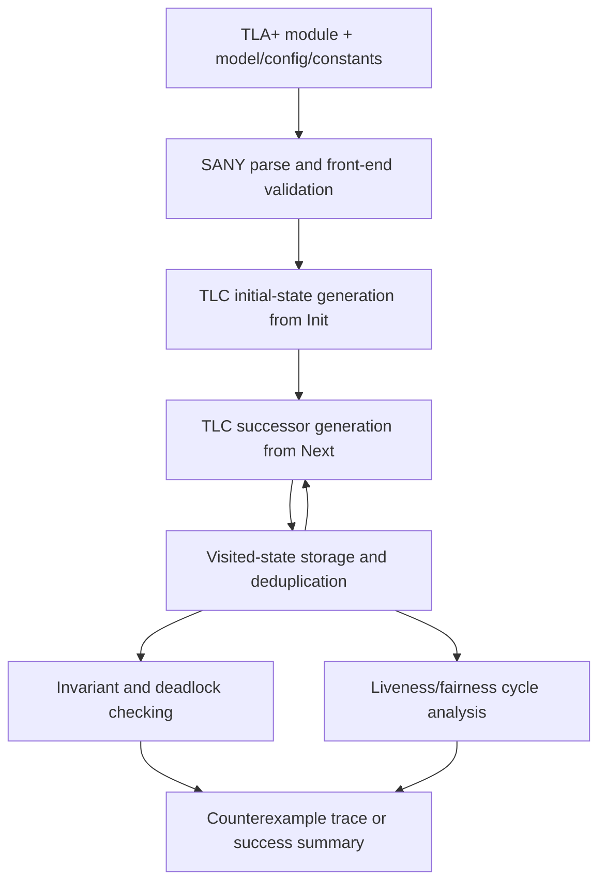

# Traditional TLA+ Model Checking (TLC-Centered)

## Beginner Toolchain Primer
Traditional TLA+ model checking is a pipeline, not a single tool.

- **TLA+** is the specification language. You write a state-machine style module that declares variables, an initial condition (`Init`), and step relation (`Next`).
- **SANY** is the front-end analyzer in the standard TLA+ toolchain. It parses the module, resolves names/imports, and rejects malformed or inconsistent spec structure before model checking.
- **TLC** is the explicit-state model checker. It takes the analyzed spec plus model settings, generates concrete initial states, repeatedly applies `Next` to generate successors, and checks properties during exploration.
- **Finite model/config** settings make checking executable: they pick concrete constant values and finite domains, choose what to check (invariants, deadlock, liveness), and therefore define the exact state space TLC will explore.

A useful beginner mental model is: **TLA+ defines behavior**, **SANY validates structure**, and **TLC explores a finite instance of that behavior**.

## What The Model/Config Contributes
TLA+ modules are usually symbolic. A model/config file turns them into a concrete run by fixing constants and bounds.

- It binds abstract constants to concrete values or finite sets.
- It can constrain the initial state and action parameters through model values and overrides.
- It selects the property checks to run (for example invariants and deadlock checks).
- It controls whether TLC explores a tiny teaching model or a larger stress model.

Because of this, two different model/config choices for the same TLA+ module can produce very different exploration size, runtime, and bug-finding behavior.

## Toolchain Overview
- TLA+ module and model/config inputs.
- Front-end parsing/validation.
- Explicit-state exploration and property checks.

## End-to-End TLC Path (Ordered)
1. **Source module + config/constants**: You provide a TLA+ module (`VARIABLES`, `Init`, `Next`, properties) plus a model/config that binds constants and finite domains.
2. **Parsing / front-end validation**: SANY parses the module and checks structural correctness (names, imports, operator references, and basic consistency) before TLC runs.
3. **Initial-state generation**: TLC evaluates `Init` under the configured constants/domains to enumerate the concrete starting states.
4. **Successor generation from `Next`**: For each frontier state, TLC evaluates `Next` to compute enabled transitions and concrete successor states.
5. **State storage / deduplication**: TLC records visited states and suppresses already-seen states so exploration does not loop forever on repeats.
6. **Invariant/deadlock checking**: During exploration, TLC checks configured invariants on reachable states and reports deadlock states when no step is enabled.
7. **Liveness/fairness handling**: If liveness properties and fairness assumptions are configured, TLC analyzes cycles/behaviors under those fairness constraints instead of only single-state safety checks.
8. **Counterexample reporting**: On violations (invariant, deadlock, or liveness), TLC emits a concrete error trace/counterexample so you can replay the failing behavior step by step.

## Traditional TLC Pipeline Diagram

## Explicit-State vs Theorem Proving
**Explicit-state model checking** means TLC enumerates concrete reachable states in a finite model and checks whether any explored behavior violates the configured properties.

- It executes the `Init`/`Next` transition system over bounded constants/domains.
- It explores reachable states and transitions directly, rather than proving formulas symbolically.
- If a property fails, the typical output is a concrete counterexample trace.
- If no violation is found, the result is "no bug found in this explored finite state space," not a universal proof for all possible model sizes.

**Theorem proving** is different: you prove symbolic claims (lemmas/invariants/refinement obligations) about all executions that satisfy the assumptions.

- The prover reasons over formulas and proof obligations instead of enumerating every concrete state.
- A successful proof can justify unbounded or parameterized guarantees, but usually requires more manual proof structure.
- The output is a checked proof artifact (or failed proof obligation), not primarily a runtime-generated bug trace.

In practice, explicit-state model checking is often used for fast bug finding on finite instances, while theorem proving is used when you need stronger all-execution guarantees.

## Practical Limits
- Finite-model assumptions.
- State explosion.
- Sensitivity to model/config choices.
